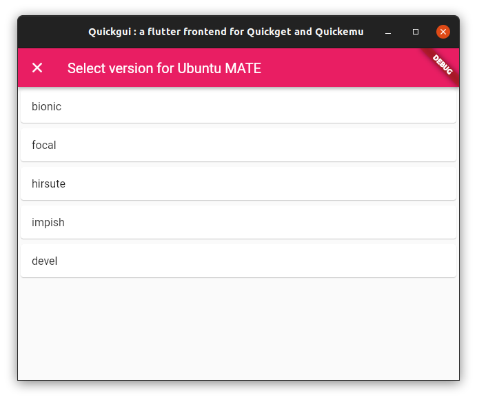
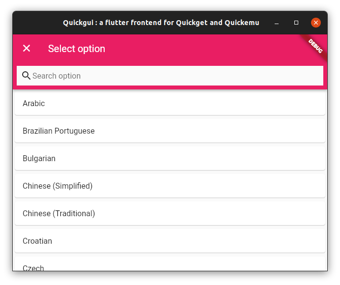
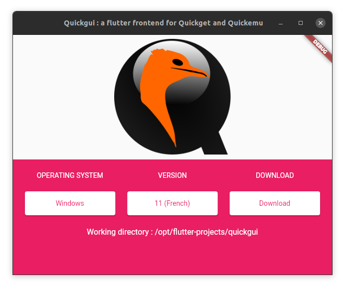
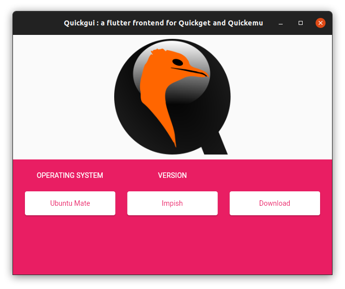

# quickgui

A Flutter frontend for [quickget](https://github.com/wimpysworld/quickemu).

## Install

* [Download](https://github.com/ymauray/quickgui/releases/) the binary.
* Uncompress the tarball wherever you want.
* From anywhere on the filesystem, run the app.

```bash
xz quickgui-a.b.c-d.tar.xz
tar xvf quickgui-a.b.c-d.tar
/path/to/quickgui
```

Alternativelly, use `update-alternatives` to install `quickgui` system-wide :

```bash
sudo update-alternatives --install /usr/local/bin/quickgui quickgui /path/to/quickgui 50
```

## Build

If you don't want to run the binary, you can rebuild the application yourself :

* [Set up Flutter](https://ubuntu.com/blog/getting-started-with-flutter-on-ubuntu)
* Clone this repo,
* Switch to the project's directory,
* Build the project,
* Run the app.

```bash
git clone https://github.com/ymauray/quickgui.git
cd quickgui
flutter build linux --release
./build/linux/x64/release/bundle/quickgui
```

You can also use `update-alternatives` for easier access to the app.

## Usage

From the main screen, select the operating system you want to use. The list can be filtered.


Then, select the version :




If there are some options (Windows language, Pop!_OS nvidia or Intel, etc..), they will be displayed :





Then click "Download". The ISO will be downloaded in the current working directory, in 99% of cases that will be the directory where `quickgui` was invoked from. The spinner will tell you where the file is being downloaded.




